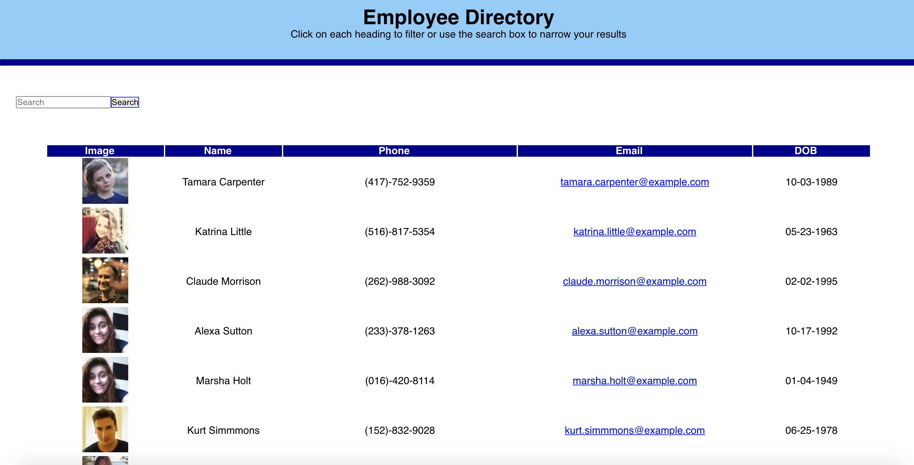

# Employee Directory

## Table of Contents
* [Description](#description)
* [URL](#url)
* [Installation](#installation)
* [License](#license)
* [Contributing](#contributing)
* [Questions](#questions)

## Description 
Employee database that allows coworkers to view contact info for the entire office. You can search for employees by name.

## URL
[Click here to see the live site!]()

[Click here to see video demonstration!](https://drive.google.com/file/d/1wCAE0NEbxVITdkElvnfBx_ZUcsOeOgYC/view?usp=sharing)
## Installation
1. Download or clone repository 2. npm install to install the required npm packages ro run

## Contributing
Open source, feel free to modify!

## Questions
* Github: https://github.com/lindseybowe

